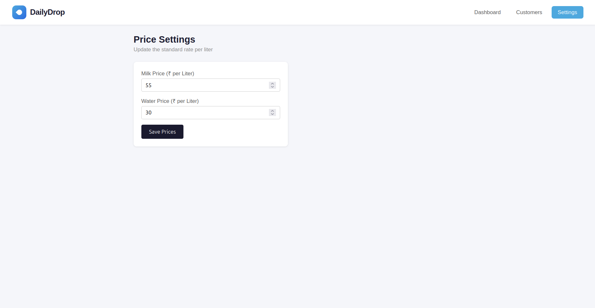

# DailyDrop — Milk & Water Delivery Tracker

A full-stack web app for small milk/water delivery vendors to track daily deliveries, manage customers, and automatically calculate monthly bills — replacing manual notebook tracking.

## Problem It Solves

Small vendors (milkmen, water can suppliers) typically track deliveries and billing by hand in a notebook. DailyDrop digitizes this: mark each customer's delivery with one click, and the app automatically calculates monthly bills based on delivered days, quantity, and rate.

## Features

- **Customer management** — add customers with daily quantity and rate
- **One-click delivery marking** — mark delivered/skipped per customer per day
- **Automatic monthly billing** — calculated from actual delivery history, no manual math
- **Dashboard analytics** — total revenue, liters sold, and visual charts (daily trend, customer revenue breakdown) using Chart.js
- **Configurable pricing** — owner can update milk/water rates anytime
- **Month/year filtering** — review past months' performance, not just the current one

## Tech Stack

**Frontend:** React (Vite), React Router, Axios, Chart.js
**Backend:** Java, Spring Boot (Spring Web, Spring Data JPA)
**Database:** PostgreSQL

## Architecture

The backend follows a layered architecture: **Controller → Service → Repository**, keeping business logic (like bill calculations) separate from web-handling and data-access code.


## Getting Started

### Prerequisites
- Java 21
- Node.js
- PostgreSQL

### Backend Setup
1. Create a PostgreSQL database named `milk_tracker_db`
2. Update `backend/src/main/resources/application.properties` with your database credentials
3. Run the Spring Boot application (via your IDE, or `./mvnw spring-boot:run`)
4. Backend runs on `http://localhost:8080`

### Frontend Setup
```bash
cd frontend
npm install
npm run dev
```
Frontend runs on `http://localhost:5173`

## API Endpoints

| Method | Endpoint | Description |
|--------|----------|--------------|
| GET | `/api/customers` | Get all customers |
| POST | `/api/customers` | Add a new customer |
| POST | `/api/delivery-logs/mark` | Mark delivery status for a customer/date |
| GET | `/api/delivery-logs/bill` | Get a customer's monthly bill |
| GET | `/api/dashboard/summary` | Get overall monthly summary stats |
| GET | `/api/dashboard/daily-breakdown` | Get daily liters/revenue for charting |
| GET | `/api/dashboard/customer-breakdown` | Get per-customer revenue for charting |
| GET/PUT | `/api/settings/prices` | Get/update current milk & water prices |

## What I Learned Building This

- Designing a layered Spring Boot backend (Controller/Service/Repository/DTO separation)
- Modeling relational data with JPA (`@ManyToOne`, foreign keys) and writing derived query methods
- Building an "upsert" pattern to avoid duplicate records (delivery marking)
- Aggregating data across relationships using Java Streams for billing calculations
- Integrating Chart.js with React for real data visualization
- Debugging real full-stack issues: CORS, package/compilation mismatches, null-data edge cases

## Screenshots

